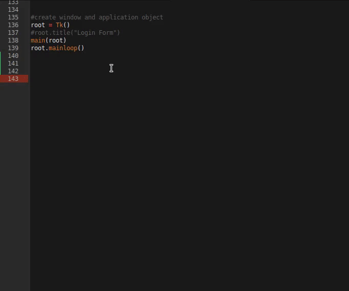

# Snippet Index

Sublime Text 3 package for [Snippet Index](https://github.com/omkarjc27/Snippet-Index)

Browse through a huge database of Code Functions/Classes/Snippets

### Installation:
**Manually** : 

Clone the repository into your Sublime Text 2/3 packages directory.

**Using Package Control** :
1. Preferences ‣ Package Control ‣ Install Package 
2. Type `Snippet-Index `.
3. Select the first and hopefully only option seen.  

### Usage:

- Context Menu 
	1. Select text to search.
	2. `RightClick` on the screen.
	3. Select `Snippet Index`.
